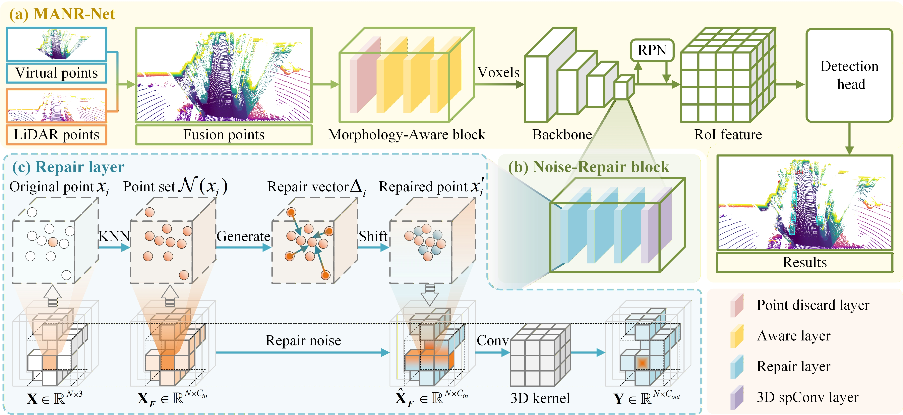

# MANR-Net: Morphology-Aware and Noise-Repair Network for 3D Object Detection
This code is mainly based on [OpenPCDet](https://github.com/open-mmlab/OpenPCDet), some codes are from [TED](https://github.com/hailanyi/TED), 
[CasA](https://github.com/hailanyi/CasA), [PENet](https://github.com/JUGGHM/PENet_ICRA2021), [SFD](https://github.com/LittlePey/SFD) and [VirConv](https://github.com/hailanyi/VirConv).

## Overall Framework
The framework of  MANR-Net is shown below.



## Model Zoo
We release the models: MANR-Net. The MANR-Net is trained with train split (3712 samples) of KITTI dataset.

## Getting Started
```
conda create -n spconv2 python=3.9
conda activate spconv2
pip install torch==1.8.1+cu111 torchvision==0.9.1+cu111 torchaudio==0.8.1 -f https://download.pytorch.org/whl/torch_stable.html
pip install numpy==1.19.5 protobuf==3.19.4 scikit-image==0.19.2 waymo-open-dataset-tf-2-5-0 nuscenes-devkit==1.0.5 spconv-cu111 numba scipy pyyaml easydict fire tqdm shapely matplotlib opencv-python addict pyquaternion awscli open3d pandas future pybind11 tensorboardX tensorboard Cython prefetch-generator
```
### Dependency
Our released implementation is tested on.
+ Ubuntu 18.04
+ Python 3.9.13 
+ PyTorch 1.8.1
+ Numba 0.53.1
+ Spconv 2.1.22 
+ NVIDIA CUDA 11.1 
+ 1 x 3090 GPU


### Prepare dataset

You must creat additional  ```velodyne_depth``` dataset to run our model. You can generate the dataset by yourself as follows:

Please download the official [KITTI 3D object detection](http://www.cvlibs.net/datasets/kitti/eval_object.php?obj_benchmark=3d) 
dataset, [KITTI odometry dataset](https://www.cvlibs.net/datasets/kitti/eval_odometry.php) and organize the downloaded files as follows (the road planes could be downloaded 
from [[road plane]](https://drive.google.com/file/d/1d5mq0RXRnvHPVeKx6Q612z0YRO1t2wAp/view?usp=sharing), 
which are optional for data augmentation in the training):

```
MANR-Net
├── data
│   ├── odometry
│   │   │── 00
│   │   │── 01
│   │   │   │── image_2
│   │   │   │── velodyne
│   │   │   │── calib.txt
│   │   │── ...
│   │   │── 21
│   ├── kitti
│   │   │── ImageSets
│   │   │── training
│   │   │   ├──calib & velodyne & label_2 & image_2 & (optional: planes)
│   │   │── testing
│   │   │   ├──calib & velodyne & image_2
├── pcdet
├── tools
```

(1) Download the PENet depth completion model from [google (500M)](https://drive.google.com/file/d/1RDdKlKJcas-G5OA49x8OoqcUDiYYZgeM/view?usp=sharing) or [baidu (gp68)](https://pan.baidu.com/s/1tBVuqvBZ0ns79ARmNpgwWw), and put it into ```tools/PENet```.

(2) Then run the following code to generate RGB virtual points.

```
cd tools/PENet
python3 main.py --detpath ../../data/kitti/training
python3 main.py --detpath ../../data/kitti/testing
```
(2) After that, run following command to creat dataset infos:
```
python3 -m pcdet.datasets.kitti.kitti_dataset_mm create_kitti_infos tools/cfgs/dataset_configs/kitti_dataset.yaml
```

Anyway, the data structure should be: 
```
MANR-Net
├── data
│   ├── kitti
│   │   │── ImageSets
│   │   │── training
│   │   │   ├──calib & velodyne & label_2 & image_2 & (optional: planes) & velodyne_depth
│   │   │── testing
│   │   │   ├──calib & velodyne & image_2 & velodyne_depth
│   │   │── semi (optional)
│   │   │   ├──calib & velodyne & label_2(pseudo label) & image_2 & velodyne_depth
│   │   │── gt_database_mm
│   │   │── gt_databasesemi
│   │   │── kitti_dbinfos_trainsemi.pkl
│   │   │── kitti_dbinfos_train_mm.pkl
│   │   │── kitti_infos_test.pkl
│   │   │── kitti_infos_train.pkl
│   │   │── kitti_infos_trainsemi.pkl
│   │   │── kitti_infos_trainval.pkl
│   │   │── kitti_infos_val.pkl
├── pcdet
├── tools
```

### Setup

```
cd MANR-Net
python setup.py develop
```

### Training

**For training the MANR-Net:**

```
cd tools
python3 train.py --cfg_file ${CONFIG_FILE}
```

The log infos are saved into log.txt
You can run ```cat log.txt``` to view the training process.

### Evaluation

```
cd tools
python3 test.py --cfg_file ${CONFIG_FILE} --batch_size ${BATCH_SIZE} --ckpt ${CKPT}
```

The log infos are saved into log-test.txt. You can run ```cat log-test.txt``` to view the test results.
## License

This code is released under the [Apache 2.0 license](LICENSE).

## Acknowledgement
[TED](https://github.com/hailanyi/TED)

[CasA](https://github.com/hailanyi/CasA)

[OpenPCDet](https://github.com/open-mmlab/OpenPCDet)

[PENet](https://github.com/JUGGHM/PENet_ICRA2021)

[SFD](https://github.com/LittlePey/SFD)

[VirConv](https://github.com/hailanyi/VirConv)


